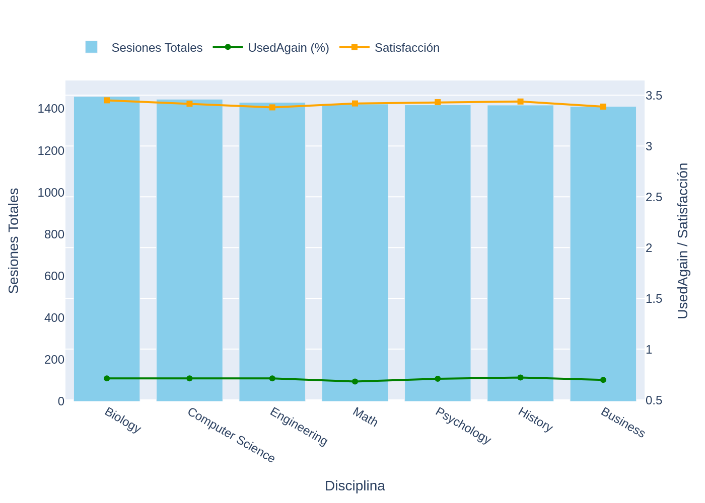

# 📚 Análisis del Uso de Asistentes de IA en la Vida Estudiantil

La inteligencia artificial se ha convertido en una herramienta cotidiana para estudiantes universitarios. Este proyecto analiza el uso de asistentes de IA a través de datos reales de distintas disciplinas académicas, basándonos en el dataset `ai_assistant_usage_student_life.csv`.

Queríamos entender no solo **quiénes usan la IA**, sino también **cómo la perciben**, qué tan **satisfechos** están y si estarían **dispuestos a usarla nuevamente**. ¿Es la IA una moda pasajera o una herramienta educativa con verdadero potencial?

---

## 🧪 Exploración de Datos

Nos enfocamos en tres variables clave:

- **Sessions (Sesiones Totales):** Número de veces que se utilizó el asistente por estudiantes de cada disciplina.
- **SatisfactionRating:** Valoración promedio de satisfacción (escala de 1 a 5).
- **UsedAgain (%):** Proporción de estudiantes que volverían a usar el asistente.

---

## 📊 Visualización de los Resultados

---

## 🧠 Principales Hallazgos

1. **Alta demanda en carreras STEM:**  
   *Biología*, *Ciencias de la Computación* e *Ingeniería* lideran en cantidad de sesiones, lo que sugiere que los estudiantes de estas disciplinas están más familiarizados con herramientas tecnológicas o dependen más de información precisa y rápida.

2. **Satisfacción positiva en áreas humanísticas:**  
   Aunque *Historia* y *Psicología* no lideran en uso, destacan por sus altas valoraciones y disposición a reutilizar la IA. Esto sugiere un impacto cualitativo más que cuantitativo, posiblemente por el apoyo que la IA brinda en redacción, síntesis de textos o generación de ideas.

3. **Adopción transversal:**  
   El índice de “Usaría de nuevo” (UsedAgain) se mantiene elevado y bastante uniforme entre disciplinas. Esto refuerza la idea de que los asistentes de IA no están limitados a un solo tipo de estudiante o carrera.

4. **Satisfacción moderada pero constante:**  
   La mayoría de las disciplinas rondan una valoración promedio de 3.4 sobre 5. Aunque hay espacio para mejorar, esto refleja una experiencia mayormente positiva.

---

## 🔄 ¿Cómo reproducir este análisis?

Puedes ejecutar todo el análisis y generar los gráficos en Google Colab con el siguiente notebook:

📎 [Haz clic aquí para abrir en Colab](https://colab.research.google.com/drive/1QPjtZkh4X8F3VG7B__lhzRSitnCz3IFW#scrollTo=6edcca56)

La verdad, me pareció súper interesante el dataset "AI vs Human Content Detection", porque trata un tema muy actual: cómo saber si un texto fue hecho por una persona o por una IA. Creo que esto es especialmente importante en el ámbito educativo, ya que ayuda a mantener la honestidad y a que los profesores puedan evaluar de forma más justa.

Además, al compararlo con nuestro dataset original, que muestra cómo los estudiantes usamos la IA en el día a día, se forma una visión mucho más completa. No solo vemos cómo se utiliza la tecnología, sino también cómo se puede verificar ese uso. Me parece una buena base para pensar en nuevas formas de enseñar y evaluar, siempre con ética y aprovechando bien las herramientas tecnológicas.

---

## 💬 Reflexión Final

La integración de asistentes de IA en la educación no solo es inevitable, sino también deseada por los propios estudiantes. Esta herramienta, lejos de reemplazar el pensamiento crítico, puede potenciarlo. Entender sus patrones de uso y percepción nos permite anticipar cómo evolucionará la experiencia académica en los próximos años.

